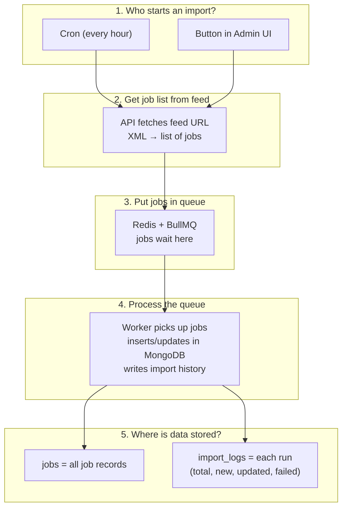

# Architecture

## Flow diagram

- **Cron** or **UI** starts a run → API **fetches** feed URL, parses XML to job list, **enqueues** to Redis.
- **Worker** takes jobs from queue, **bulk upserts** into `jobs` (by externalId + sourceUrl), then writes one row to **import_logs** (counts + failure reasons).

## In short

- **job_sources** (Mongo) = list of feed URLs. Cron uses enabled ones; UI can trigger one.
- **Queue** = Redis + BullMQ. Big feeds are split into chunks (e.g. 25k jobs per queue job) so we don’t put 1M in one payload.
- **Worker** = separate process. For each queue job: upsert in batches (bulkWrite), then insert into import_logs.
- **Import history screen** = table from import_logs (fileName = URL, total / new / updated / failed, pagination, filter by URL).

---

*For a visual in draw.io or Excalidraw: draw the same flow (Trigger → API → Fetch → Queue → Worker → MongoDB), export as PNG, and add to this folder as e.g. `architecture.png`, then link: ``.*
